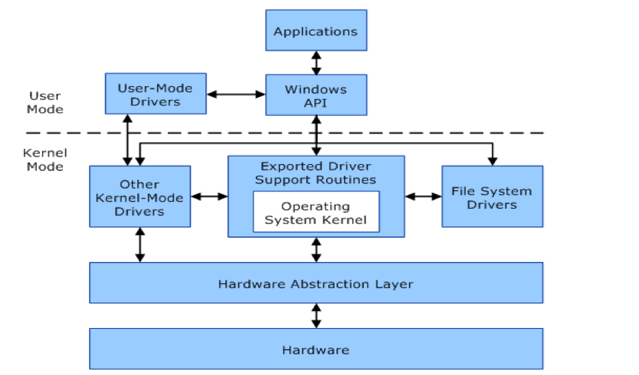
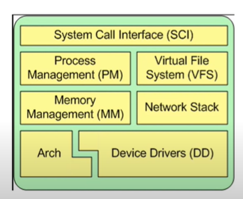
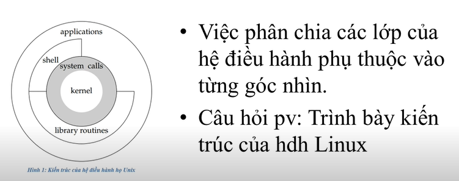
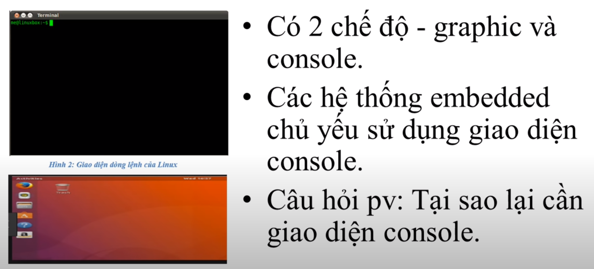

# Entry requirements: knowledge about C programming language and microcontroller
# Knowledge gained after the course: Can write device driver

## Objective: 
Training Linux Embedded for people who have good knowledge about C programming and MCU
## Roadmap
 
1. OS general - Work on user layer
- Coding
- File manager
- User manager
- multithreat
2. Work on Device drive programming
- Device driver programming
- kernel 
- final project : 1 product or add a feature driver 

# 1.TỔNG QUAN VỀ HĐH UNIX
- Giới thiệu về các OS hệ Unix
- Các chức năng chính của 1 OS
- Kiến trúc Linux OS
- Giao diện người dùng
- Chương trình và tiến trình
- Hệ điều hành đa nhiệm
- Hệ thống file system
---------------------------------------------------------------------
## Introduce Unix OS
- Founded 1973
- Tối ưu hóa hoạt động
- được tạo ra cho máy tính trong tương lai
- ĐƯỢC kế thừa bởi các hệ điều hành hiện nay: Window, MacOS, Linux,..
=> Lập trình Linux rất giống Unix
## Chức năng chính của OS

- OS là chương trình đầu tiên được chạy, nó sở hữu và có quyền quyết định các thành phần khác của hệ thống
- Scheduling, memory, management, file system,...
    Tính năng chính của HĐH là gÌ?
Có rất nhiều tính năng, và tương đồng nhau, ko có cái nào nổi trội hơn cả
## Kiến trúc của Linux OS

- Việc phân chia các lớp OS phụ thuộc vào gốc nhìn
- Trình bày kiến trúc Linux OS
    Device driver nằm trong kernel 
## Giao diện người sử dụng 

- Có 2 chế độ: Graphic và console     
- Linux là được thiết kế cho developer: nên dùng chế độ console (chỉ có bàn phím và chữ) để dùng ít tài nguyên hơn
# Chương trình và tiến trình 
- Chương trình: là file binary được build từ source code và nằm trên ổ cứng
- Tiến trình: là các chương trình đã được build và load trên hệ thống(đang chạy) và đang tiêu tốn tài nguyên hệ thống
- Câu hỏi: Chương trình và tiến trình khác nhau ntn?
# Hệ điều hành đa nhiệm
- Máy tính xử lí thông tin nhanh hơn não con người rất nhiều
- Hệ điều hành đa nhiệm: là chuyển đổi giữa các task trong thời gian rất ngắn, tạo ra cảm giác máy có thể làm nhiều task 1 lúc, nhưng thật ra là trong thời gian hiện tại máy chỉ có thể làm 1 task 
- HĐH đa nhiệm có thể chạy trân hệ thống single core đc không ?
    -> Có thể chạy đa nhiệm bình thường.
# Hệ thống file system:
Là thư mục root (giống thư mục "My PC" ở Window)

