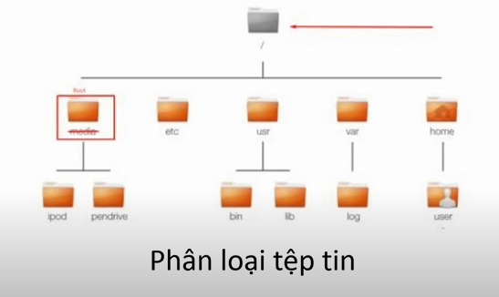

# READING - WRITING - CHANGING FILES IN LINUX

Đọc ghi file là công viêc được thực hiện nhiều trong lập trình trên linux

1. Phân loại tập tin 

Hình 1. Cây thư mục

# Có 3 loại dự liệu chính 
## Regular file:
    - Là các file chứa dữ liệu tồn tại thực tế trên ổ cứng
    - Không bị mất khi khởi động lại hệ thống
    - Mỗi loại file có một (định đạng) format dư liệu riêng

VD đọc 1 file có format riêng là như thế nào:
- File binary được build từ code C
- định dạng không đọc được (đọc ko hiểu)
- chương trình hiểu được định (format) dạng này sẽ chạy được

## Directory/Folder - thư mục:
    - Là file nằm trên ổ cứng
    - Dữ liệu trong thư mục là "tên" 1 số thông tin của cá file nằm trong nó 
    - Không có định dạng (format) riêng 
Lệnh đọc: ls
## Các loại file khác:
    - Meta data
    - Symbolic link
    - Virtual file(không tồn tại thự tế trên ổ cứng, sinh ra khi đọc ghi đến chúng): Socket, Device file, STDIN, STDOUT, STDERR,..

### File descriptor
Là 1 struct - dùng để quản lí đọc ghi file
Hàm đọc ghi sẽ trả về số nguyên không âm, số nguyên đó chính là descriptor.

LÀ 1 ARRAY 
vị trí 0,1,2 lưu STDIN, STDOUT, STDERR
các số nguyên trả về là các giá trị index của mảng này.

- Là một số nguyên không âm
- Đại diện cho index chứa con trỏ file trong file table của process
- Index 0 cho STDIN, 1: STDOUT, 2:STDERR

# VẬY,Tác dụng của toán tử ">" ?
VD:
In output dư liệu vào 1 file 
```shell
ls > a.txt
echo "in vao day" > b.txt
```
# Có chương trình sau:
```shell
```

# Các hàm cơ bản Read/write file
```shell
# Trả về biến interger fd, 
int open(const char *pathname, int flags)
# Đóng file
int close(int fd)
# Tham số fd ở trên,  buf đọc dữ liệu truyền vào, cout đọc bao nhiêu . Trả về giá trị số byte đọc được
ssize_t read(int fd, void *buf, size_t count)
# buf chứa dữ liệu cần ghi, trả về số byte dữ liệu ghi được
ssize_t write(int fd, const void *buf, size_t count)
# Dịch đầu lọc bao nhiêu byte, offset dịch đi bao nhiêu, số so sánh dịch từ đâu
off_t lseek(int fd, off_t offset, int whence)
# Ghi all dữ liệu trong bộ nhớ đệm vào đĩa. để tối ưu đọc file, dùng trước khi tắt máy
# ghi vào RAM 
void sync(void)
```


